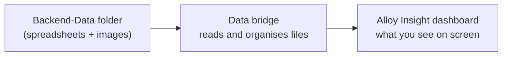

# Connecting Backend-Data to the Alloy Insight Dashboard

> Plan for wiring the real research files in `Backend-Data/` to the Alloy Insight dashboard.

## The big picture (in plain terms)

Right now the dashboard shows **demo data** — fake melt-pool images and placeholder 3D shapes.

Your **`Backend-Data`** folder already has **real research outputs**: temperature and size measurements layer by layer, comparison spreadsheets, and mechanical test results for 316L stainless steel builds.

**The goal:** build a **data bridge** (a small helper program) that reads those files and feeds them into the dashboard the user already has. No need to re-run MATLAB during normal use — we use the Excel and PNG files that already exist.

Think of it like this:



---

## What's in Backend-Data? (two types of research data)

### 1. Melt-pool monitoring (during the build)

This is what the dashboard's 2×2 view is designed for.

| What you have | Plain English | Used for on screen |
|---------------|---------------|-------------------|
| **KIV images** (`*_L22temp.png`, `*_L22size.png`) | A chart for each layer showing temperature or melt-pool size | **Raw images** panel — flip through layers like a film strip |
| **meantemp / meansize spreadsheets** | Summary stats across all layers for each build | **Thresholded data** — red/blue hot/cold regions |
| **LAYER INFO COMPARE spreadsheets** | Table of average temp and size for every layer, every build | **3D views** and **statistics** at the bottom |

**Coverage note:** Detailed KIV chart images exist for **2 builds** (`60045010r2` and `60047207r2`). The other **24 builds** have spreadsheet data but not per-layer PNGs — for those we'll draw simple layer charts from the spreadsheet so the dashboard still works.

### 2. Tensile testing (after the build)

| What you have | Plain English | Used for on screen |
|---------------|---------------|-------------------|
| **9 raw Excel files** | Machine output from pulling test coupons | Not in the current dashboard layout |
| **Stress-strain / yield / UTS charts** | Plots from the MATLAB scripts | **Phase 2** — optional extra panel later |
| **Consolidated summary spreadsheets** | E, yield, UTS, fracture stats across all specimens | **Phase 2** — could enrich the stats bar |

For the first version we focus on **melt-pool data** (matches your handwritten GUI sketch). Mechanical testing can be added later without changing the core plan.

> **Data availability check:** the raw tensile Excel files and stress-strain /
> yield / UTS charts described above are **not present** in `Backend-Data/`.
> What exists is tensile *CAD* (`Subsize tensile specimen *.STEP/SLDPRT`),
> coupon *photos*, and the NC programs (`amdata/DES/AM_CouponTensile_*.mpf`) —
> no measurements. Phase 2 needs that data sourced before it can be built.

---

## How build names work

Each build has an ID like **`60047207r2`**. You can read it as:

| Part | Meaning | Example (`60047207r2`) |
|------|---------|------------------------|
| Digits 1-2 | **Sample length (mm)** | `60` → 60 mm |
| Digits 3-4 | **Number of passes** | `04` → 4-pass |
| Digits 5-6 | **Number of layers** | `72` → 72 layers |
| Digits 7-8 | **Layer increment (mm)**, in 0.1 mm units | `07` → 0.7 mm |
| `r2` | **Run / replicate** | Run 2 |

Source: `Backend-Data/part naming convention.txt`, confirmed by the data owner
and verified against all 26 builds — `meantemp_<id>.xlsx` has exactly one
column per layer, and its `b_<z>` labels step by the layer increment.

**Design invariant:** layers × increment ≈ 50 mm for every coupon
(50×1.0, 56×0.9, 63×0.8, 72×0.7, 84×0.6). Every sample is a ~50 mm wall built
at a different resolution, so layer count and increment always co-vary.

> Earlier drafts of this plan read the last two digits as *wall* thickness and
> treated digits 3-5 as a "material/process code". That is wrong: it is the
> *layer* increment, and the layer count was dropped entirely.

Spreadsheets use the shorthand **`7r2_4pass`** — the same coupon as
**`60047207r2`** (0.7 mm increment, run 2, 4-pass). The data bridge knows both.

**Coverage note:** only the 4-pass group has a 0.6 mm coupon (`60048406r1/r2`).
The coarser 4-pass coupons did not build well enough for tensile testing, so
0.6 mm was run specifically to secure a usable set — a deliberate recovery run,
not a gap in the matrix.

---

## What the user experience will look like

### Stage 1 — Setup (unchanged flow, real choices)

Instead of uploading files, the user:

1. Picks **316L SS** (all Backend-Data is this material)
2. Picks **process / pass count** (4-pass, 7-pass, or 10-pass) — filters the build list
3. Picks a **build sample** from a dropdown, e.g. `60047207r2 · 0.7 mm · 4-pass · R2`
4. Melting temperature auto-fills (~1450 °C); user can adjust
5. Clicks **Run analysis**

### Stage 2 — Analysis (same layout, real data)

| Dashboard panel | Where the data comes from |
|-----------------|---------------------------|
| **Raw images** | KIV temperature chart PNGs (layer by layer), or a generated chart if no PNGs |
| **Thresholded data** | Size/temperature histograms — red = too hot, blue = too cool |
| **3D reconstruction** | Stack layers using size from LAYER INFO — like stacking slices of the build |
| **Three-color 3D** | Same stack, coloured green = in spec, red = hot, blue = cool |
| **Statistics bar** | How many layers are stable vs drifting vs alert (your `<10%`, `10–30%`, `≥30%` idea) |

---

## What we need to build (three pieces)

### Piece 1 — The data bridge (new, runs in the background)

A small program that:

- Scans `Backend-Data/` on startup and builds a **catalog** of all 26 builds
- Knows which files belong to which build
- Answers requests from the dashboard ("give me layer 22 for build 60047207r2")
- Serves image files directly from the KIV folders

**We will not re-run MATLAB.** We only read the Excel and PNG files that already exist.

### Piece 2 — Small dashboard updates

- Setup screen: **dropdown of builds** instead of file upload
- Threshold panel: show the **actual histogram image** when we have one
- Point the dashboard at the data bridge instead of demo mode

### Piece 3 — Documentation

- How to start both the dashboard and the data bridge together
- Which builds have full KIV images vs spreadsheet-only data

---

## How each screen panel gets its numbers (simple rules)

**Threshold (red / blue):**
- Read the temperature summary spreadsheet for that build
- **Red** = proportion of readings well above the melting point (hot tail)
- **Blue** = proportion well below (cold tail)

**3D reconstruction:**
- Each layer becomes a block in a stack
- Block width/depth follows melt-pool **size** from LAYER INFO
- Stack height = layer number (layer 1 at bottom, layer 72 at top)

**Three-color 3D:**
- **Green** = layer temp and size both look normal for that build
- **Red** = temperature too high
- **Blue** = temperature too low

**Statistics bar:**
- Compare each layer's temperature to the build average
- Count how many layers drift less than 10%, between 10–30%, or more than 30%
- Yellow = transition zone, red = alert (matches your notebook notes)

---

## What stays the same vs what changes

| Stays the same | Changes |
|----------------|---------|
| Two-stage flow (Setup → Analysis) | Data source: real files instead of fake demo |
| 2×2 dashboard layout | Setup: pick a build from a list |
| Material, process, melt temp fields | Build ID becomes the session name (e.g. `60047207r2`) |
| Statistics colour scheme | Threshold panel can show real histogram images |

---

## Build order (step by step)

1. **Data bridge skeleton** — start the helper program, confirm it can read the Backend-Data folder
2. **Build catalog** — list all 26 samples with thickness, pass count, replicate
3. **Read LAYER INFO spreadsheets** — pull temp and size for every layer
4. **Connect all dashboard requests** — frames, threshold, 3D, stats
5. **Fallback charts** — for the 24 builds without KIV PNGs, generate simple layer charts
6. **Update setup screen** — build dropdown wired to catalog
7. **Show real images in threshold panel**
8. **Test end-to-end** — try `60047207r2` (full images) and one spreadsheet-only build

---

## Later improvements (not required for first version)

- Add a **mechanical properties** section using the tensile test Excel files and stress-strain charts
- Allow uploading **new** data (not just picking from existing builds)
- Live updates during a build (today everything is post-processed files)

---

## How we'll know it's working

- User opens the dashboard, picks build `60047207r2`, and sees **72 real layer charts** in the raw images panel
- Threshold, 3D, and stats match the numbers in your LAYER INFO spreadsheets
- A build without KIV PNGs (e.g. `60045010r1`) still shows a complete dashboard using spreadsheet data
- Turning off demo mode loads real data with no manual file copying

---

## Technical reference (for developers)

### Data bridge location

```
server/
  src/
    index.ts              # Main program entry
    routes/               # Handles dashboard requests
    services/             # Reads spreadsheets, builds 3D, computes stats
    parsers/xlsx.ts       # Excel file reader
```

### API routes (dashboard already expects these)

| Request | Reads from |
|---------|------------|
| `GET /catalog` | Scan `meantemp_*.xlsx` + LAYER INFO workbooks |
| `POST /sessions` | User's chosen build ID |
| `GET /sessions/:id/frames` | KIV temp PNGs or generated chart |
| `GET /sessions/:id/threshold/:frameId` | `meantemp_` + `meansize_` xlsx |
| `GET /sessions/:id/reconstruction` | LAYER INFO size row |
| `GET /sessions/:id/three-color` | LAYER INFO temp + size rows |
| `GET /sessions/:id/stats` | Layer drift from LAYER INFO |

### Frontend files to touch

- `src/components/setup/SetupForm.tsx` — build dropdown
- `src/domain/types.ts` — add `sampleId`, `passCount`, `thicknessMm`
- `src/api/catalog.ts` — new catalog fetch
- `src/components/analysis/ThresholdPanel.tsx` — optional image display
- `vite.config.ts` — connect dashboard to data bridge on port 3001

### Stack

Express + TypeScript + Excel reader. No MATLAB at runtime.

### Implementation checklist

- [ ] Build the data bridge: a small program that reads Backend-Data and serves it to the dashboard
- [ ] Create a build catalog — scan spreadsheets and list all 26 samples with thickness, pass count, and replicate info
- [ ] Write the logic that turns spreadsheets and images into dashboard views (frames, thresholds, 3D, stats)
- [ ] Wire up the data bridge so the dashboard can request each view (same requests it already makes today)
- [ ] Update the setup screen — pick a build from a dropdown instead of uploading files
- [ ] Show real size/temperature histogram images in the threshold panel when available
- [ ] Connect dashboard + data bridge for local testing; document how to run with real data
